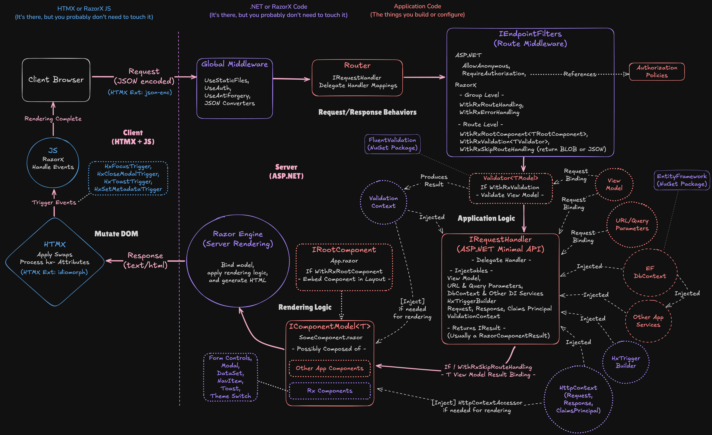

# RazorX

An ASP.NET and htmx meta-framework

The name RazorX represents the combination of ASP.NET Razor Components on the server with htmx on the client. ASP.NET Minimal APIs provide the request-response processing between the client and server. Razor Components are only used for server-side templating, and there are no dependencies on Blazor for routing or interactivity.

## Getting started

Install the required dependencies, if necessary.

- [.NET SDK](https://dotnet.microsoft.com/en-us/download) >= 9.0
- [Node.js](https://nodejs.org/en) or similar JS runtime for tailwindcss
- [Azurite VS Code extension](https://marketplace.visualstudio.com/items?itemName=Azurite.azurite)

Download and install the template

1. Download the `Package/RazorX.Template.1.0.0-beta.nupkg`
2. Install the template `dotnet new install RazorX.Template.1.0.0-beta.nupkg`
3. Create a new app with `dotnet new razorx`

[OR]

Build and install the template

1. Clone the razorx repository.
2. Use the /RxTemplatePack/makefile to build and install the template. If you're on Windows, you may need to create the template manually by copying the RxTemplate folder to RxTemplatePack/content and running the dotnet CLI commands in the makefile.
3. Create a new app with `dotnet new razorx`.

## Request/Response Cycle

The following diagram describes the flow of a request. The basic concept is to first route the request through a series of middleware, both global and endpoint specific (`IEndpointFilters`). This applies common behaviors like anti-forgery token validation, authorization policy enforcement, and model validation. Next, the request is routed to a specific handler (`IRequestHandler Delegate`) for processing application logic. The request handler will usually return a `RazorComponentResult` for creating an HTML response. Finally, htmx may modify the DOM to swap partial content and trigger events specified in response headers. The events are handled with JavaScript event handlers in `razorx.js`.



## How To - The Demo TODO List Tutorial

The following covers the basics of creating a new page, adding a model and validation, and making it reactive with htmx. After working through this, I recommend checking out the included examples. The template includes many components which work well with the htmx hypermedia approach and have client-side JavaScript behaviors for an enhanced experience.

1. [Create a Demo application](#create-a-demo-application)
2. [Create a new page](#create-a-new-page)
3. [Add a model](#add-a-model)
4. [Add a Create TODO feature](#add-a-create-todo-feature)
   - [PROBLEM: The form is not reset after saving a TODO - SOLUTION: Send a new form after saving a TODO](#problem-the-form-is-not-reset-after-saving-a-todo---solution-send-a-new-form-after-saving-a-todo)
   - [PROBLEM: Empty TODOs can be created - SOLUTION: Add model validation](#problem-empty-todos-can-be-created---solution-add-model-validation)
5. [Add a Complete TODO feature](#add-a-complete-todo-feature)
6. [Add a Delete TODO feature](#add-a-delete-todo-feature)
7. [Add a Update TODO feature](#add-a-update-todo-feature)
8. [EXTRA CREDIT - Add a Change Validation feature](#extra-credit---add-a-change-validation-feature)

### Rendering


### Component Anatomy


### Create a Demo application

- Create a new `Demo` folder.
- Run the `dotnet new razorx` command in a terminal in the `Demo` folder to spawn a new RazorX application.
- Run the `dotnet watch` command in the terminal to launch the app. The browser should launch the app. If not, open a browser and go to `https://localhost:44376/`.
- Once you verify the app runs, go ahead and shutdown the server using `Ctrl-C` in the terminal.

### Create a new page

- Create a new `Todos` folder under `Components`.
- Create a new `TodosPage.razor` file.
- Create a new `TodosHandler.cs` file.

**_Add the following code to the `TodosPage.razor` file._**

```csharp
<HeadContent>
    <title>TODOs</title>
</HeadContent>

<div id="todos-page">
    <div class="flex justify-center">
        <article class="prose">
            <div class="flex justify-center">
                <h2>TODOs</h2>
            </div>
        </article>
    </div>
    <div class="flex justify-center w-full">
        <div class="w-2xl">
            <div class="flex flex-col justify-center w-full">
            </div>
        </div>
    </div>
</div>
```

**_Add the following code to the `TodosHandler.cs` file._**

- All pages have an associated `IRequestHandler`. This interface has one method, `MapRoutes`, which maps the endpoints to delegates.
- Endpoint filters may be applied to provide route-specific behavior. The filters are executed in the order they are applied, so behaviors like authorization should be defined first.
- The `WithRxRootComponent` filter indicates that the `RazorComponentResult` should be embedded in the layout `IRootComponent`. The `UseRxRouter` call in `Program.cs` specifies a default root component, `Components/Layout/App.razor`, but an override layout may be specified with `WithRxRootComponent<T>` where T is an `IRootComponent`.

```csharp
using Demo.Rx;

namespace Demo.Components.Todos;

public class TodosHandler : IRequestHandler {

    public void MapRoutes(IEndpointRouteBuilder router) {

        router.MapGet("/todos", Get)
            .AllowAnonymous()
            .WithRxRootComponent();
    }

    public static IResult Get(
        HttpResponse response) {
        return response.RenderComponent<TodosPage>();
    }
}
```

**_Add a nav link to the new page by opening the `Components/Layout/Nav.razor` file and adding the following `@* NEW *@` code._**

```csharp
<div class="z-50 bg-base-100 min-h-full w-96 p-4">
  <div class="flex justify-between items-center">
    <h2 class="text-2xl font-semibold text-primary">Demo Menu</h2>
    @* ...code omitted *@
  </div>
  <ul class="menu w-full">
    <li>
      <RxNavItem
        NavItemRoute="/"
        CurrentRouteClass="font-semibold">
        Home
      </RxNavItem>
    </li>
    @* NEW *@
    <li>
        <RxNavItem
            NavItemRoute="/todos"
            CurrentRouteClass="font-semibold">
            TODOs
        </RxNavItem>
    </li>
    @* END NEW *@
    <li>
      <RxNavItem
        NavItemRoute="/examples"
        MatchPartial="@(true)"
        CurrentRouteClass="font-semibold"
      >
        Examples
      </RxNavItem>
    </li>
    @* ...code omitted *@
  </ul>
</div>
```

**_Save all files and run the `dotnet watch` command in the terminal to launch the app. The `TODOs` page should be available from the nav menu._**

### Add a model

**_Create a new `TodosDbContext.cs` file in `Components/Todos` and add the following code._**

- When developing an application, you will most likely use `EntityFramework` for persistence.
- The below code is a fake implementation for demonstration purposes only, and it is up to you to bring your on EF implementation.

```csharp
namespace Demo.Components.Todos;

// Fake DbContext - This would be an EF context in a real application and would NOT be defined here!
// The use of this object in the handler would be different:
// 1. The DbContext would be injected into the handler delegates (i.e., Get, Post, etc.,) and NOT be static.
// 2. The delegate handlers would be async Task<IResult> methods for EF async/await operations.
public static class FakeDbContext {

    public static readonly IList<Todo> Todos = [];

}

// Todo Entity - This would be an EF entity in a real application and would NOT be defined here!
public class Todo {
    public string Id { get; set; } = null!;
    public string Title { get; set; } = null!;
    public string Description { get; set; } = null!;
    public bool IsComplete { get; set; }
    public DateTime LastUpdated { get; set; }
}
```

**_Create a new `TodosModel.cs` file in `Components/Todos` and add the following code._**

- This is the model for our TODO feature. While it may begin with a shape that is nearly identical to the entity, the entity should not be substituted as the model. In almost all cases, the model shape will diverge from the entity.
- The model properties should be nullable if the property will be bound to an input element that the user may leave blank, even if this will be caught as a validation error. Think of a required `<input type="number" name="Quantity" />` that will be deserialized into a `Quantity` property. The user may choose to leave the input element blank, which will be deserialized as null. The validator would add a validation error for this condition, and the user would see the error and correct it. The `required` element attribute may be used to apply upfront validation, but browser validation implementations vary and are limited, so I prefer to use server validation only to keep everything consistent.
- This example uses a `record` type for immutability, but `class` and `struct` may also be used for models if preferred.

```csharp
namespace Demo.Components.Todos;

public record TodoModel
(
    string? Id = null,
    string? Title = null,
    string? Description = null,
    bool IsComplete = false,
    DateTime? LastUpdated = null
);
```

### Add a Create TODO feature

**_Create a new `TodosForm.razor` file in `Components/Todos` and add the following code._**

- This component represents an HTML fragment for the TODO input elements that serialize to the model's `Title` and `Description` properties.
- This fragment will be used in the `TodosNew` and `TodosUpdateModal` components, which is why it is a separate component.
- Any component that binds to a model must implement the `IComponentModel<T>` interface, where T is the type of model.
- RazorX component `Id` parameters map to HTML Element `id` attributes and must be unique. If an `Id` is not set, RazorX will generate a unique value for the element. However, in many cases the `Id` will need to be a known value for htmx `hx-target` attributes or JavaScript `getElementById` operations. In these cases, the `Id` must be computed and assigned.
- The `TodosForm` component uses the RazorX `Field` component for the `Title` property binding and the `MemoField` component for the `Description` property binding.
- All RazorX components will use the assigned `{Id}-input` format for the underlying HTML input element `id`.
- The `PropertyName` parameter is what binds the component to the model's property. The `PropertyName` translates to the HTML input element's `name` attribute, which is the key used for the key-value pair on form submission. For easier refactoring, it is recommended to use the `nameof` expression to set the `PropertyName` instead of a hard-coded string.
- `Components/Rx` contains many pre-built components to accelerate development. They are separated into `Headless` and `Skinned`. `Headless` components implement structure and behavior, and `Skinned` components wrap associated `Headless` components with CSS styling.

```csharp
@implements IComponentModel<TodoModel>

<div>
    <!-- Title Field -->
    <Field
        Id="@($"{nameof(Model.Title)}{Model.Id}")"
        PropertyName="@(nameof(Model.Title))"
        Value="@(Model.Title)"
        Label="Title"
        InputType="text"
        UseOpacityForValidationErrors="@(true)"
        maxlength="80"
        placeholder="e.g., Learn the RazorX meta-framework!">
    </Field>
</div>
<div>
    <!-- Description Memo Field -->
    <MemoField
        Id="@($"{nameof(Model.Description)}{Model.Id}")"
        PropertyName="@(nameof(Model.Description))"
        Value="@(Model.Description)"
        Label="Description"
        MaxLength="500"
        UseOpacityForValidationErrors="@(true)"
        placeholder="e.g., This includes reading the htmx documentation and checking out Tailwind and daisyUI.">
    </MemoField>
</div>

@code {
    [Parameter] public TodoModel Model { get; set; } = null!;
}
```

**_Create a new `TodosNew.razor` file in `Components/Todos` and add the following code._**

- This component represents the fragment that contains the form for creating new TODOs.
- It embeds the `TodosForm` component from above as a child component and passes the model parameter down.
- The HTML form element's `hx-` attributes define the htmx behaviors for the form.
- The `hx-post` tells htmx to issue a POST request to the `/todos` endpoint on form submission.
- The `hx-target` is the element that will be targeted in the response. In this case, the `#` means use the `id` to identify the element. CSS selector syntax is used by htmx for element identification.
- The `hx-swap` defines the swap strategy htmx should use to place the response in the targeted element. Most often this will be `innerHTML` (the default) or `outerHTML` to replace the entire element. In this case, the `beforeend` strategy is used to tell htmx to append the new TODO to the end of the list contained in the `<div id="todos-list">` element.

```csharp
@implements IComponentModel<TodoModel>

<div id="todos-new" class="flex flex-col w-full gap-y-3">
    <form hx-post="/todos" hx-target="#todos-list" hx-swap="beforeend" novalidate>
        <TodosForm Model="@(Model)" />
        <div class="flex justify-end">
            <button type="submit" class="btn btn-primary">
                Submit
            </button>
        </div>
    </form>
</div>

@code {
    [Parameter] public TodoModel Model { get; set; } = null!;
}
```

**_Create a new `TodosItem.razor` file in `Components/Todos` and add the following code._**

- This component represents a TODO list item.
- It uses the `RxUtcToLocal` component to convert a UTC date from the server to the local timezone of the client. It is recommended to always persist date-time values as UTC since they may then be converted to whatever timezone is most appropriate.

```csharp
@implements IComponentModel<TodoModel>

<div id="@($"todos-item-{Model.Id}")" class="card card-border border-base-300 bg-base-200 w-full mb-2">
    <div class="card-body">
        <div class="flex gap-2 justify-between items-center">
            <div class="flex min-w-20">
            </div>
            <div class="flex grow justify-center py-2">
                <h2 class="card-title">@(Model.Title)</h2>
            </div>
            <div class="flex justify-end gap-x-2 min-w-20">
            </div>
        </div>
        <p class="whitespace-pre">
            @(Model.Description)
        </p>
        <div class="flex justify-end text-xs">
            <RxUtcToLocal DateInput="@(Model.LastUpdated!.Value)" />
        </div>
    </div>
</div>

@code {
    [Parameter] public TodoModel Model { get; set; } = null!;
}
```

**_Update the TodosPage Component with the `@* New *@` Component Fragments_**

- Declaring a model for the page component is done by implementing `IComponentModel`. In this case, a list of TODOs is used since the page will display all the TODOs, as well as provide a way to create a new TODO.
- The `TodosNew` component is passed a new `TodoModel` since this will be an empty form.

```csharp
@* NEW *@
@implements IComponentModel<IEnumerable<TodoModel>>
@* END NEW *@

<HeadContent>
    <title>TODOs</title>
</HeadContent>

<div id="todos-page">
    <div class="flex justify-center">
        <article class="prose">
            <div class="flex justify-center">
                <h2>TODOs</h2>
            </div>
        </article>
    </div>
    <div class="flex justify-center w-full">
        <div class="w-2xl">
            <div class="flex flex-col justify-center w-full">
                @* NEW *@
                <div id="todos-list">
                    @foreach (var todo in Model) {
                        <TodosItem Model="@(todo)" />
                    }
                </div>
                <TodosNew Model="@(new())"/>
                @* END NEW *@
            </div>
        </div>
    </div>
</div>

@* NEW *@
@code {
    [Parameter] public IEnumerable<TodoModel> Model { get; set; } = null!;
}
@* END NEW *@
```

**_Update the TodosHandler with the `//New` component fragments for creating TODOs_**

- The delegate `Get` is updated to query the fake DbContext and project list of `TodoModel`s.
- A new POST route and delegate is added to the handler. The model is bound to the delegate. RazorX uses an htmx extension that coverts form key-value pairs (the htmx default) into JSON. RazorX includes custom JSON converters for deserializing this JSON into model objects.
- The delegate updates the model's `Id` and `LastUpdated` properties before binding it to the component in the response.
- The `IHxTriggers` builder is injected into the POST delegate. `HxTriggers` are used to set response headers that htmx will dispatch events on. Depending on the type of trigger, the event may be dispatched immediately on receiving the response, after htmx processes the swap, or after the DOM is settled. For example, setting focus to an element should wait until the DOM is settled. In this specific case, the success toast is popped and the `Title` input element is focused.
- The handlers for the `IHxTriggers` dispatched events are located in the `wwwroot/js/razorx.js` file, but no customization should be needed for any implementations in this file. `IHxTriggers` is capable of dispatching custom events, and in this case the developer is responsible for implementing the JavaScript handlers.

```csharp
using Demo.Rx;

namespace Demo.Components.Todos;

public class TodosHandler : IRequestHandler {

    public void MapRoutes(IEndpointRouteBuilder router) {

        router.MapGet("/todos", Get)
            .AllowAnonymous()
            .WithRxRootComponent();

        //NEW
        router.MapPost("/todos", Post)
            .AllowAnonymous();
        //END NEW
    }

    public static IResult Get(
        HttpResponse response) {
        //NEW
        //return response.RenderComponent<TodosPage>();
        var model = FakeDbContext.Todos.Select(x => new TodoModel(
            x.Id,
            x.Title,
            x.Description,
            x.IsComplete,
            x.LastUpdated));
        return response.RenderComponent<TodosPage, IEnumerable<TodoModel>>(model);
        //END NEW
    }

    //NEW
    public static IResult Post(
        HttpResponse response,
        IHxTriggers hxTriggers,
        TodoModel model) {
        var todo = new Todo {
            Id = Guid.NewGuid().ToString(),
            Title = model.Title!,
            Description = model.Description!,
            LastUpdated = DateTime.UtcNow,
            IsComplete = false
        };
        FakeDbContext.Todos.Add(todo);
        model = model with {
            Id = todo.Id,
            LastUpdated = todo.LastUpdated
        };
        hxTriggers
            .With(response)
            .Add(new HxToastTrigger("#success-toast", $"New TODO created."))
            .Add(new HxFocusTrigger($"#{nameof(todo.Title)}-input"))
            .Build();
        return response.RenderComponent<TodosItem, TodoModel>(model);
    }
    //END NEW
}
```

**_Run the `dotnet watch` command in the terminal to launch the app (or `Ctrl-R` to rebuild if it is running). You should now be able to add TODOs to the list._**

#### PROBLEM: The form is not reset after saving a TODO - SOLUTION: Send a new form after saving a TODO

**_Update the TodosModel with the `//New` code._**

- The model is now further deviating from the EF entity. In this case, we're adding a `ResetForm` flag to indicate that the form should be reset after successfully creating a new TODO.

```csharp
namespace Demo.Components.Todos;

public record TodoModel
(
    //NEW
    bool ResetForm = false,
    //END NEW
    string? Id = null,
    string? Title = null,
    string? Description = null,
    bool IsComplete = false,
    DateTime? LastUpdated = null
);
```

**_Update the TodosItem component with the `@* NEW *@` code._**

- The `TodosItem` component is returned after a successful POST call to add a new TODO.
- The model's `ResetForm` flag is evaluated to see if a new `TodosNew` component should be included in the response.

```csharp
@implements IComponentModel<TodoModel>

@* NEW *@
@if (Model.ResetForm) {
    <TodosNew Model="@(new())" />
}
@* END NEW *@

<div id="@($"todos-item-{Model.Id}")" class="card card-border border-base-300 bg-base-200 w-full mb-2">
    <div class="card-body">
        <div class="flex gap-2 justify-between items-center">
            <div class="flex min-w-20">
            </div>
            <div class="flex grow justify-center py-2">
                <h2 class="card-title">@(Model.Title)</h2>
            </div>
            <div class="flex justify-end gap-x-2 min-w-20">
            </div>
        </div>
        <p class="whitespace-pre">
            @(Model.Description)
        </p>
        <div class="flex justify-end text-xs">
            <RxUtcToLocal DateInput="@(Model.LastUpdated!.Value)" />
        </div>
    </div>
</div>

@code {
    [Parameter] public TodoModel Model { get; set; } = null!;
}
```

**_Update the TodosNew component with the `@* NEW *@` code._**

- The `hx-swap-oob="true"` attribute is added to the `TodosNew` component's main container div. This tells htmx that this content may exist as an additional fragment in a response, and when it does to swap the content in the DOM.
- The default swap strategy for oob (out of band) swaps is `outerHTML`, but a different strategy may be specified in place of `true`. The typical swap strategy for oob swaps will be `outerHTML`.

```csharp
@implements IComponentModel<TodoModel>

@* NEW *@
@* <div id="todos-new" class="flex flex-col w-full gap-y-3"> *@
<div id="todos-new" class="flex flex-col w-full gap-y-3" hx-swap-oob="true">
@* END NEW *@
    <form hx-post="/todos" hx-target="#todos-list" hx-swap="beforeend" novalidate>
        <TodosForm Model="@(Model)" />
        <div class="flex justify-end">
            <button type="submit" class="btn btn-primary">
                Submit
            </button>
        </div>
    </form>
</div>

@code {
    [Parameter] public TodoModel Model { get; set; } = null!;
}
```

**_Update the `TodosHandler` with the `//NEW` code._**

- Update the `Get` delegate with the `ResetForm` flag set to false.
- Update the `Post` delegate with the `ResetForm` flag set to true. This will include the `TodosNew` component in the `TodosItem` response and htmx will replace the existing form with a new one, effectively clearing the prior inputs.

```csharp
using Demo.Rx;

namespace Demo.Components.Todos;

public class TodosHandler : IRequestHandler {

    public void MapRoutes(IEndpointRouteBuilder router) {

        router.MapGet("/todos", Get)
            .AllowAnonymous()
            .WithRxRootComponent();

        router.MapPost("/todos", Post)
            .AllowAnonymous();
    }

    public static IResult Get(
        HttpResponse response) {
        var model = FakeDbContext.Todos.Select(x => new TodoModel(
            //NEW
            false,
            //END NEW
            x.Id,
            x.Title,
            x.Description,
            x.IsComplete,
            x.LastUpdated));
        return response.RenderComponent<TodosPage, IEnumerable<TodoModel>>(model);
    }

    public static IResult Post(
        HttpResponse response,
        IHxTriggers hxTriggers,
        TodoModel model) {
        var todo = new Todo {
            Id = Guid.NewGuid().ToString(),
            Title = model.Title!,
            Description = model.Description!,
            LastUpdated = DateTime.UtcNow,
            IsComplete = false
        };
        FakeDbContext.Todos.Add(todo);
        model = model with {
            //NEW
            ResetForm = true,
            //END NEW
            Id = todo.Id,
            LastUpdated = todo.LastUpdated
        };
        hxTriggers
            .With(response)
            .Add(new HxToastTrigger("#success-toast", $"New TODO created."))
            .Add(new HxFocusTrigger($"#{nameof(todo.Title)}-input"))
            .Build();
        return response.RenderComponent<TodosItem, TodoModel>(model);
    }
}
```

**_Run the `dotnet watch` command in the terminal to launch the app (or `Ctrl-R` to rebuild if it is running). The form should reset after adding a TODO._**

#### PROBLEM: Empty TODOs can be created - SOLUTION: Add model validation

**_Create a new `TodosValidator.cs` file in `Components/Todos` and add the following code._**

- Validators are extended from FluentValidation's `AbstractValidator`.
- Errors are collected in a request-scoped `ValidationContext` object.
- The `ValidationContext` may be injected anywhere it is needed, including the `IRequestHandler` delegates and `RazorComponents`.
- The model must be deserialized from the request's JSON payload before validation. This is why model properties should be nullable if the user may choose to not provide a value, even if the property is required.
- In this case, the model's `Title` and `Description` properties are validated for required value and max length.

```csharp
using FluentValidation;
using Demo.Rx;

namespace Demo.Components.Todos;

public class TodosValidator : Validator<TodoModel> {

    public TodosValidator(ValidationContext validationContext) : base(validationContext) {

        RuleFor(x => x.Title)
            .NotEmpty()
            .WithMessage("Title is Required.")
            .MaximumLength(80)
            .WithMessage("Title has a maximum length of 80 characters.");
        RuleFor(x => x.Description)
            .NotEmpty()
            .WithMessage("Description is Required.")
            .MaximumLength(500)
            .WithMessage("Description has a maximum length of 500 characters.");

    }
}
```

**_Update the `TodosHandler` with the `//NEW` code._**

- Adding the `WithRxValidation<T>` filter where T is a `Validator` will trigger validation.
- Validation occurs before the `IRequestHandler` delegate is invoked.
- The `ValidationContext` is injected into the `Post` delegate.
- If the `ValidationContext` contains errors, the `Post` delegate responds with the `TodosNew` component instead of the `TodosItem` component.
- All RazorX components inject the `ValidationContext` and have built-in validation error display styling.
- The response extension methods `HxRetarget` and `HxReswap` are used to set response headers for htmx. These headers will override the original `hx-target` and `hx-swap` attributes for the request. They may also be used if the `hx-target` or `hx-swap` was not specified to begin with.

```csharp
using Demo.Rx;

namespace Demo.Components.Todos;

public class TodosHandler : IRequestHandler {

    public void MapRoutes(IEndpointRouteBuilder router) {

        router.MapGet("/todos", Get)
            .AllowAnonymous()
            .WithRxRootComponent();

        router.MapPost("/todos", Post)
            .AllowAnonymous()//;
            //NEW
            .WithRxValidation<TodosValidator>();
            //END NEW
    }

    public static IResult Get(
        HttpResponse response) {
        var model = FakeDbContext.Todos.Select(x => new TodoModel(
            false,
            x.Id,
            x.Title,
            x.Description,
            x.IsComplete,
            x.LastUpdated));
        return response.RenderComponent<TodosPage, IEnumerable<TodoModel>>(model);
    }

    public static IResult Post(
        HttpResponse response,
        IHxTriggers hxTriggers,
        TodoModel model,
        //NEW
        ValidationContext validationContext) {
        if (validationContext.Errors.Count != 0) {
            response.HxRetarget("#todos-new");
            response.HxReswap("outerHTML");
            return response.RenderComponent<TodosNew, TodoModel>(model);
        }
        //END NEW
        var todo = new Todo {
            Id = Guid.NewGuid().ToString(),
            Title = model.Title!,
            Description = model.Description!,
            LastUpdated = DateTime.UtcNow,
            IsComplete = false
        };
        FakeDbContext.Todos.Add(todo);
        model = model with {
            ResetForm = true,
            Id = todo.Id,
            LastUpdated = todo.LastUpdated
        };
        hxTriggers
            .With(response)
            .Add(new HxToastTrigger("#success-toast", $"New TODO created."))
            .Add(new HxFocusTrigger($"#{nameof(todo.Title)}-input"))
            .Build();
        return response.RenderComponent<TodosItem, TodoModel>(model);
    }
}
```

**_Run the `dotnet watch` command in the terminal to launch the app (or `Ctrl-R` to rebuild if it is running). You should not be able to add invalid TODOs._**

### Add a Complete TODO feature

**_Update the TodosItem component with the `@* NEW *@` code._**

- A RazorX `Checkbox` component is added to allow the user to mark the TODO as complete. It is bound to the model's `IsComplete` property.
- The `hx-patch`, `hx-target`, and `hx-swap` attributes are added directly to the `Checkbox`. The `hx-trigger` attribute is not used, but may be added if needed. Sensible defaults are used by htmx when attributes are omitted. In this case, the trigger is the `onchange` event.
- When the `Checkbox` is checked, htmx will send a PATCH request to the endpoint, including the `Id` of the TODO item.
- The response will replace the entire TODO item, and a "COMPLETED" badge will be displayed if the TODO item is marked as completed.

```csharp
@implements IComponentModel<TodoModel>

@if (Model.ResetForm) {
    <TodosNew Model="@(new())" />
}

<div id="@($"todos-item-{Model.Id}")" class="card card-border border-base-300 bg-base-200 w-full mb-2">
    <div class="card-body">
        <div class="flex gap-2 justify-between items-center">
            <div class="flex min-w-20">
                @* NEW *@
                <div>
                    <Checkbox
                        Id="@($"todos-item-completed-{Model.Id}")"
                        PropertyName="@(nameof(Model.IsComplete))"
                        IsChecked="@(Model.IsComplete)"
                        aria-label="Complete"
                        hx-patch="@($"/todos/{Model.Id}")"
                        hx-target="@($"#todos-item-{Model.Id}")"
                        hx-swap="outerHTML"
                        >
                    </Checkbox>
                </div>
                @* END NEW *@
            </div>
            <div class="flex grow justify-center py-2">
                <h2 class="card-title">@(Model.Title)</h2>
            </div>
            <div class="flex justify-end gap-x-2 min-w-20">
            </div>
        </div>
        @* NEW *@
        <div class="flex justify-center">
            @if (Model.IsComplete) {
                <span class="bg-success text-success-content rounded-full px-2 font-semibold">COMPLETED</span>
            } else {
                <span>&nbsp;</span>
            }
        </div>
        @* END NEW *@
        <p class="whitespace-pre">
            @(Model.Description)
        </p>
        <div class="flex justify-end text-xs">
            <RxUtcToLocal DateInput="@(Model.LastUpdated!.Value)" />
        </div>
    </div>
</div>

@code {
    [Parameter] public TodoModel Model { get; set; } = null!;
}
```

**_Update the `TodosHandler` with the `//NEW` code._**

- Add the `IRequestHandler` endpoint and delegate mapping for the PATCH request. This includes the `{id}` route segment for the TODO `Id`.
- The `Patch` delegate reads the todo entity from the fake DbContext, updates the `IsComplete` property, and projects a new todo model for binding to the `TodosItem` component in the response.
- If the todo entity is not found, a `TypedResults.NoContent` (204) response is returned. HTTP response codes are evaluated for specific meaning by htmx. 204 tells htmx to not process the response. In this case, using a `TypedResults.NotFound` (404) might be a better option. Using this code would invoke htmx error processing, as does any code >= 400. RazorX will redirect a user to an error page when htmx signals an error. For a situation like this, the 404 would force the user to return to the TODO page and the removed item would no longer be on the list. Of course, developers may choose to handle concurrency situations more elaborately. `The Kitchen Sync` example does this by pre-fetching an item before an update operation is processed and displays a message to the user that their data is stale. My general recommendation is to return a 404 so the user is required to navigate to the fresh page to continue.

```csharp
using Demo.Rx;

namespace Demo.Components.Todos;

public class TodosHandler : IRequestHandler {

    public void MapRoutes(IEndpointRouteBuilder router) {

        router.MapGet("/todos", Get)
            .AllowAnonymous()
            .WithRxRootComponent();

        router.MapPost("/todos", Post)
            .AllowAnonymous()
            .WithRxValidation<TodosValidator>();

        //NEW
        router.MapPatch("/todos/{id}", Patch)
            .AllowAnonymous();
        //END NEW
    }

    public static IResult Get(
        HttpResponse response) {
        var model = FakeDbContext.Todos.Select(x => new TodoModel(
            false,
            x.Id,
            x.Title,
            x.Description,
            x.IsComplete,
            x.LastUpdated));
        return response.RenderComponent<TodosPage, IEnumerable<TodoModel>>(model);
    }

    public static IResult Post(
        HttpResponse response,
        IHxTriggers hxTriggers,
        TodoModel model,
        ValidationContext validationContext) {
        if (validationContext.Errors.Count != 0) {
            response.HxRetarget("#todos-new");
            response.HxReswap("outerHTML");
            return response.RenderComponent<TodosNew, TodoModel>(model);
        }
        var todo = new Todo {
            Id = Guid.NewGuid().ToString(),
            Title = model.Title!,
            Description = model.Description!,
            LastUpdated = DateTime.UtcNow,
            IsComplete = false
        };
        FakeDbContext.Todos.Add(todo);
        model = model with {
            ResetForm = true,
            Id = todo.Id,
            LastUpdated = todo.LastUpdated
        };
        hxTriggers
            .With(response)
            .Add(new HxToastTrigger("#success-toast", $"New TODO created."))
            .Add(new HxFocusTrigger($"#{nameof(todo.Title)}-input"))
            .Build();
        return response.RenderComponent<TodosItem, TodoModel>(model);
    }

    //NEW
    public static IResult Patch(
        HttpResponse response,
        IHxTriggers hxTriggers,
        string id) {
        var todo = FakeDbContext.Todos.Where(x => x.Id == id).SingleOrDefault();
        if (todo is null) {
            return TypedResults.NoContent();
        }
        todo.IsComplete = !todo.IsComplete;
        var model = new TodoModel(
            false,
            todo.Id,
            todo.Title,
            todo.Description,
            todo.IsComplete,
            todo.LastUpdated);
        hxTriggers
            .With(response)
            .Add(new HxToastTrigger("#success-toast", $"Updated TODO to {(todo.IsComplete ? "completed" : "not completed")}."))
            .Add(new HxFocusTrigger($"#todos-item-completed-{todo.Id}"))
            .Build();
        return response.RenderComponent<TodosItem, TodoModel>(model);
    }
    //END NEW
}
```

**_Run the `dotnet watch` command in the terminal to launch the app (or `Ctrl-R` to rebuild if it is running). You should be able to mark TODOs as complete._**

### Add a Delete TODO feature

**_Update the TodosItem component with the `@* NEW *@` code._**

- Add a `RxModalTrigger` component to display a modal confirmation dialog.
- `RxModalTrigger`s are HTML button elements.
- The `ModalId` is the `id` attribute value of the `dialog` element.
- The `RouteValue` is the value to append to the `hx-` request route.
- The `TextNodeValue` is any item-specific text that needs to be displayed in the dialog.

```csharp
@implements IComponentModel<TodoModel>

@if (Model.ResetForm) {
    <TodosNew Model="@(new())" />
}

<div id="@($"todos-item-{Model.Id}")" class="card card-border border-base-300 bg-base-200 w-full mb-2">
    <div class="card-body">
        <div class="flex gap-2 justify-between items-center">
            <div class="flex min-w-20">
                <div>
                    <Checkbox
                        Id="@($"todos-item-completed-{Model.Id}")"
                        PropertyName="@(nameof(Model.IsComplete))"
                        IsChecked="@(Model.IsComplete)"
                        aria-label="Complete"
                        hx-patch="@($"/todos/{Model.Id}")"
                        hx-target="@($"#todos-item-{Model.Id}")"
                        hx-swap="outerHTML"
                        >
                    </Checkbox>
                </div>
            </div>
            <div class="flex grow justify-center py-2">
                <h2 class="card-title">@(Model.Title)</h2>
            </div>
            <div class="flex justify-end gap-x-2 min-w-20">
                @* NEW *@
                <RxModalTrigger
                    ModalId="delete-todo-modal"
                    RouteValue="@(Model.Id)"
                    TextNodeValue="@($"Delete {Model.Title}?")"
                    class="btn btn-square btn-sm btn-error"
                    aria-label="@($"Delete {Model.Title}?")">
                    <span class="text-xl">&#x2715;</span>
                </RxModalTrigger>
                @* END NEW *@
            </div>
        </div>
        <div class="flex justify-center">
            @if (Model.IsComplete) {
                <span class="bg-success text-success-content rounded-full px-2 font-semibold">COMPLETED</span>
            } else {
                <span>&nbsp;</span>
            }
        </div>
        <p class="whitespace-pre">
            @(Model.Description)
        </p>
        <div class="flex justify-end text-xs">
            <RxUtcToLocal DateInput="@(Model.LastUpdated!.Value)" />
        </div>
    </div>
</div>

@code {
    [Parameter] public TodoModel Model { get; set; } = null!;
}
```

**_Update the TodosPage component with the `@* NEW *@` code._**

- Add the HTML `dialog` element to the page and assign it the `id` specified in the `RxModalTrigger`'s `ModalId`.
- In this case, the `RxModalTextNode` is used as the modal's title.
- The `RxModalDismiss` component is a button that will close the modal.
- The `RxModalAction` component is a button that can issue an `hx-` request. In this case, the request is a DELETE to the `/todos` endpoint. The `RouteValue` set on the `RxModalTrigger` will be appended to the endpoint, so the final endpoint is `DELETE: todos/{id}`.
- The `hx-disabled-elt` attribute will disable the button while the request is in-flight.
- The `RxModalAction` component will not close the modal when clicked. This is important because the server may need to return validation errors to the modal in some cases.

```csharp
@implements IComponentModel<IEnumerable<TodoModel>>

<HeadContent>
    <title>TODOs</title>
</HeadContent>

@* NEW *@
<dialog id="delete-todo-modal" class="modal modal-bottom sm:modal-middle">
    <div class="modal-box">
        <div class="flex justify-between items-center bg-base-300 p-5 rounded-sm">
            <div class="text-lg font-bold">
                <RxModalTextNode ModalId="delete-todo-modal" />
            </div>
        </div>
        <form method="dialog">
            <div class="p-5">
                This is a destructive operation. Are you sure?
            </div>
            <div class="modal-action">
                <RxModalDismiss ModalId="delete-todo-modal" autofocus class="btn btn-neutral">
                    Cancel
                </RxModalDismiss>
                <RxModalAction
                    ModalId="delete-todo-modal"
                    hx-delete="/todos"
                    hx-disabled-elt="this"
                    class="btn btn-error">
                    Delete
                </RxModalAction>
            </div>
        </form>
    </div>
</dialog>
@* END NEW *@

<div id="todos-page">
    <div class="flex justify-center">
        <article class="prose">
            <div class="flex justify-center">
                <h2>TODOs</h2>
            </div>
        </article>
    </div>
    <div class="flex justify-center w-full">
        <div class="w-2xl">
            <div class="flex flex-col justify-center w-full">
                <div id="todos-list">
                    @foreach (var todo in Model) {
                        <TodosItem Model="@(todo)" />
                    }
                </div>
                <TodosNew Model="@(new())"/>
            </div>
        </div>
    </div>
</div>

@code {
    [Parameter] public IEnumerable<TodoModel> Model { get; set; } = null!;
}
```

**_Update the `TodosHandler` with the `//NEW` code._**

- Add the `IRequestHandler` endpoint and delegate mapping for the DELETE request. This includes the `{id}` route segment for the TODO `Id`.
- The `Delete` delegate will remove the TODO from the fake DbContext, if it exists. We don't care if it has previously been deleted by a different user since the action is DELETE.
- The `HxCloseModalTrigger` is added to the response to signal the close of the modal.
- The `HxRetarget` and `HxReswap` extension methods are used to specify the `outerHTML` of the TODO item being deleted. These attributes could have been applied to the `RxModalAction` component instead.
- The response is `TypedResults.Ok` (200). When a 200 is returned for a DELETE, htmx will remove the targeted element using the specified swap strategy.

```csharp
using Demo.Rx;

namespace Demo.Components.Todos;

public class TodosHandler : IRequestHandler {

    public void MapRoutes(IEndpointRouteBuilder router) {

        router.MapGet("/todos", Get)
            .AllowAnonymous()
            .WithRxRootComponent();

        router.MapPost("/todos", Post)
            .AllowAnonymous()
            .WithRxValidation<TodosValidator>();

        router.MapPatch("/todos/{id}", Patch)
            .AllowAnonymous();

        //NEW
        router.MapDelete("/todos/{id}", Delete)
            .AllowAnonymous();
        //END NEW
    }

    public static IResult Get(
        HttpResponse response) {
        var model = FakeDbContext.Todos.Select(x => new TodoModel(
            false,
            x.Id,
            x.Title,
            x.Description,
            x.IsComplete,
            x.LastUpdated));
        return response.RenderComponent<TodosPage, IEnumerable<TodoModel>>(model);
    }

    public static IResult Post(
        HttpResponse response,
        IHxTriggers hxTriggers,
        TodoModel model,
        ValidationContext validationContext) {
        if (validationContext.Errors.Count != 0) {
            response.HxRetarget("#todos-new");
            response.HxReswap("outerHTML");
            return response.RenderComponent<TodosNew, TodoModel>(model);
        }
        var todo = new Todo {
            Id = Guid.NewGuid().ToString(),
            Title = model.Title!,
            Description = model.Description!,
            LastUpdated = DateTime.UtcNow,
            IsComplete = false
        };
        FakeDbContext.Todos.Add(todo);
        model = model with {
            ResetForm = true,
            Id = todo.Id,
            LastUpdated = todo.LastUpdated
        };
        hxTriggers
            .With(response)
            .Add(new HxToastTrigger("#success-toast", $"New TODO created."))
            .Add(new HxFocusTrigger($"#{nameof(todo.Title)}-input"))
            .Build();
        return response.RenderComponent<TodosItem, TodoModel>(model);
    }

    public static IResult Patch(
        HttpResponse response,
        IHxTriggers hxTriggers,
        string id) {
        var todo = FakeDbContext.Todos.Where(x => x.Id == id).SingleOrDefault();
        if (todo is null) {
            return TypedResults.NoContent();
        }
        todo.IsComplete = !todo.IsComplete;
        var model = new TodoModel(
            false,
            todo.Id,
            todo.Title,
            todo.Description,
            todo.IsComplete,
            todo.LastUpdated);
        hxTriggers
            .With(response)
            .Add(new HxToastTrigger("#success-toast", $"Updated TODO to {(todo.IsComplete ? "completed" : "not completed")}."))
            .Add(new HxFocusTrigger($"#todos-item-completed-{todo.Id}"))
            .Build();
        return response.RenderComponent<TodosItem, TodoModel>(model);
    }

    //NEW
    public static IResult Delete(
        HttpResponse response,
        IHxTriggers hxTriggers,
        string id) {
        var todo = FakeDbContext.Todos.Where(x => x.Id == id).SingleOrDefault();
        if (todo is not null) {
            FakeDbContext.Todos.Remove(todo);
        }
        hxTriggers
            .With(response)
            .Add(new HxCloseModalTrigger("#delete-todo-modal"))
            .Add(new HxToastTrigger("#success-toast", $"TODO deleted."))
            .Add(new HxFocusTrigger($"#{nameof(todo.Title)}-input"))
            .Build();
        response.HxRetarget($"#todos-item-{id}");
        response.HxReswap("outerHTML");
        return TypedResults.Ok();
    }
    //END NEW
}
```

**_Run the `dotnet watch` command in the terminal to launch the app (or `Ctrl-R` to rebuild if it is running). You should be able to delete TODOs._**

### Add a Update TODO feature

**_Update the TodosItem component with the `@* NEW *@` code._**

```csharp
@implements IComponentModel<TodoModel>

@if (Model.ResetForm) {
    <TodosNew Model="@(new())" />
}

<div id="@($"todos-item-{Model.Id}")" class="card card-border border-base-300 bg-base-200 w-full mb-2">
    <div class="card-body">
        <div class="flex gap-2 justify-between items-center">
            <div class="flex min-w-20">
                <div>
                    <Checkbox
                        Id="@($"todos-item-completed-{Model.Id}")"
                        PropertyName="@(nameof(Model.IsComplete))"
                        IsChecked="@(Model.IsComplete)"
                        aria-label="Complete"
                        hx-patch="@($"/todos/{Model.Id}")"
                        hx-target="@($"#todos-item-{Model.Id}")"
                        hx-swap="outerHTML"
                        >
                    </Checkbox>
                </div>
            </div>
            <div class="flex grow justify-center py-2">
                <h2 class="card-title">@(Model.Title)</h2>
            </div>
            <div class="flex justify-end gap-x-2 min-w-20">
                @* NEW *@
                <RxModalTrigger
                    Id="@($"todos-item-edit-{Model.Id}")"
                    ModalId="update-todo-modal"
                    RouteValue="@(Model.Id)"
                    TextNodeValue="@($"Update {Model.Title}?")"
                    class="btn btn-square btn-sm btn-primary"
                    aria-label="@($"Update {Model.Title}?")">
                    <span class="text-xl">&#9998;</span>
                </RxModalTrigger>
                @* END NEW *@
                <RxModalTrigger
                    ModalId="delete-todo-modal"
                    RouteValue="@(Model.Id)"
                    TextNodeValue="@($"Delete {Model.Title}?")"
                    class="btn btn-square btn-sm btn-error"
                    aria-label="@($"Delete {Model.Title}?")">
                    <span class="text-xl">&#x2715;</span>
                </RxModalTrigger>
            </div>
        </div>
        <div class="flex justify-center">
            @if (Model.IsComplete) {
                <span class="bg-success text-success-content rounded-full px-2 font-semibold">COMPLETED</span>
            } else {
                <span>&nbsp;</span>
            }
        </div>
        <p class="whitespace-pre">
            @(Model.Description)
        </p>
        <div class="flex justify-end text-xs">
            <RxUtcToLocal DateInput="@(Model.LastUpdated!.Value)" />
        </div>
    </div>
</div>

@code {
    [Parameter] public TodoModel Model { get; set; } = null!;
}
```

**_Update the TodosPage component with the `@* NEW *@` code._**

```csharp
@implements IComponentModel<IEnumerable<TodoModel>>

<HeadContent>
    <title>TODOs</title>
</HeadContent>

<dialog id="delete-todo-modal" class="modal modal-bottom sm:modal-middle">
    <div class="modal-box">
        <div class="flex justify-between items-center bg-base-300 p-5 rounded-sm">
            <div class="text-lg font-bold">
                <RxModalTextNode ModalId="delete-todo-modal" />
            </div>
        </div>
        <form method="dialog">
            <div class="p-5">
                This is a destructive operation. Are you sure?
            </div>
            <div class="modal-action">
                <RxModalDismiss ModalId="delete-todo-modal" autofocus class="btn btn-neutral">
                    Cancel
                </RxModalDismiss>
                <RxModalAction
                    ModalId="delete-todo-modal"
                    hx-delete="/todos"
                    hx-disabled-elt="this"
                    class="btn btn-error">
                    Delete
                </RxModalAction>
            </div>
        </form>
    </div>
</dialog>

@* NEW *@
<dialog id="update-todo-modal" class="modal modal-bottom sm:modal-middle">
    <div class="modal-box">
        <div class="flex justify-between items-center bg-base-300 p-5 rounded-sm">
            <div class="text-lg font-bold">
                <RxModalTextNode ModalId="update-todo-modal" />
            </div>
        </div>
        <form method="dialog">
            <RxModalAsyncContent
                Id="todo-update-modal-content"
                ModalId="update-todo-modal"
                RenderFromRoute="/todos">
                <FallbackContent />
            </RxModalAsyncContent>
        </form>
    </div>
</dialog>
@* END NEW *@

<div id="todos-page">
    <div class="flex justify-center">
        <article class="prose">
            <div class="flex justify-center">
                <h2>TODOs</h2>
            </div>
        </article>
    </div>
    <div class="flex justify-center w-full">
        <div class="w-2xl">
            <div class="flex flex-col justify-center w-full">
                <div id="todos-list">
                    @foreach (var todo in Model) {
                        <TodosItem Model="@(todo)" />
                    }
                </div>
                <TodosNew Model="@(new())"/>
            </div>
        </div>
    </div>
</div>

@code {
    [Parameter] public IEnumerable<TodoModel> Model { get; set; } = null!;
}
```

**_Create a new `TodosUpdateModal.razor` file in `Components/Todos` and add the following code._**

```csharp
@implements IComponentModel<TodoModel>

<div id="todo-update-modal-content">
    <TodosForm Model="@(Model)" />
    <div class="modal-action">
        <RxModalDismiss ModalId="update-todo-modal" autofocus class="btn btn-neutral">
            Cancel
        </RxModalDismiss>
    </div>
</div>

@code {
    [Parameter] public TodoModel Model { get; set; } = null!;
}
```

**_Update the `TodosHandler` with the `//NEW` code._**

```csharp
using Demo.Rx;

namespace Demo.Components.Todos;

public class TodosHandler : IRequestHandler {

    public void MapRoutes(IEndpointRouteBuilder router) {

        router.MapGet("/todos", Get)
            .AllowAnonymous()
            .WithRxRootComponent();

        router.MapPost("/todos", Post)
            .AllowAnonymous()
            .WithRxValidation<TodosValidator>();

        router.MapPatch("/todos/{id}", Patch)
            .AllowAnonymous();

        router.MapDelete("/todos/{id}", Delete)
            .AllowAnonymous();

        //NEW
        router.MapGet("/todos/{id}", GetUpdateModal)
            .AllowAnonymous();
        //END NEW
    }

    public static IResult Get(
        HttpResponse response) {
        var model = FakeDbContext.Todos.Select(x => new TodoModel(
            false,
            x.Id,
            x.Title,
            x.Description,
            x.IsComplete,
            x.LastUpdated));
        return response.RenderComponent<TodosPage, IEnumerable<TodoModel>>(model);
    }

    public static IResult Post(
        HttpResponse response,
        IHxTriggers hxTriggers,
        TodoModel model,
        ValidationContext validationContext) {
        if (validationContext.Errors.Count != 0) {
            response.HxRetarget("#todos-new");
            response.HxReswap("outerHTML");
            return response.RenderComponent<TodosNew, TodoModel>(model);
        }
        var todo = new Todo {
            Id = Guid.NewGuid().ToString(),
            Title = model.Title!,
            Description = model.Description!,
            LastUpdated = DateTime.UtcNow,
            IsComplete = false
        };
        FakeDbContext.Todos.Add(todo);
        model = model with {
            ResetForm = true,
            Id = todo.Id,
            LastUpdated = todo.LastUpdated
        };
        hxTriggers
            .With(response)
            .Add(new HxToastTrigger("#success-toast", $"New TODO created."))
            .Add(new HxFocusTrigger($"#{nameof(todo.Title)}-input"))
            .Build();
        return response.RenderComponent<TodosItem, TodoModel>(model);
    }

    public static IResult Patch(
        HttpResponse response,
        IHxTriggers hxTriggers,
        string id) {
        var todo = FakeDbContext.Todos.Where(x => x.Id == id).SingleOrDefault();
        if (todo is null) {
            return TypedResults.NoContent();
        }
        todo.IsComplete = !todo.IsComplete;
        var model = new TodoModel(
            false,
            todo.Id,
            todo.Title,
            todo.Description,
            todo.IsComplete,
            todo.LastUpdated);
        hxTriggers
            .With(response)
            .Add(new HxToastTrigger("#success-toast", $"Updated TODO to {(todo.IsComplete ? "completed" : "not completed")}."))
            .Add(new HxFocusTrigger($"#todos-item-completed-{todo.Id}"))
            .Build();
        return response.RenderComponent<TodosItem, TodoModel>(model);
    }

    public static IResult Delete(
        HttpResponse response,
        IHxTriggers hxTriggers,
        string id) {
        var todo = FakeDbContext.Todos.Where(x => x.Id == id).SingleOrDefault();
        if (todo is not null) {
            FakeDbContext.Todos.Remove(todo);
        }
        hxTriggers
            .With(response)
            .Add(new HxCloseModalTrigger("#delete-todo-modal"))
            .Add(new HxToastTrigger("#success-toast", $"TODO deleted."))
            .Add(new HxFocusTrigger($"#{nameof(todo.Title)}-input"))
            .Build();
        response.HxRetarget($"#todos-item-{id}");
        response.HxReswap("outerHTML");
        return TypedResults.Ok();
    }

    //NEW
    public static IResult GetUpdateModal(
        HttpResponse response,
        string id) {
        var todo = FakeDbContext.Todos.Where(x => x.Id == id).SingleOrDefault();
        if (todo is null) {
            return TypedResults.NotFound();
        }
        var model = new TodoModel(
            false,
            todo.Id,
            todo.Title,
            todo.Description,
            todo.IsComplete,
            todo.LastUpdated);
        return response.RenderComponent<TodosUpdateModal, TodoModel>(model);
    }
    //END NEW
}
```

**_Run the `dotnet watch` command in the terminal to launch the app (or `Ctrl-R` to rebuild if it is running). You should be able to trigger the TODO update modal._**

**_Update the TodosUpdateModal component with the `@* NEW *@` code._**

```csharp
@implements IComponentModel<TodoModel>

<div id="todo-update-modal-content">
    <TodosForm Model="@(Model)" />
    <div class="modal-action">
        <RxModalDismiss ModalId="update-todo-modal" autofocus class="btn btn-neutral">
            Cancel
        </RxModalDismiss>
        @* NEW *@
        <RxModalAction
            ModalId="update-todo-modal"
            hx-put="@($"/todos/{Model.Id}")"
            hx-disabled-elt="this"
            class="btn btn-primary">
            Save
        </RxModalAction>
        @* END NEW *@
    </div>
</div>

@code {
    [Parameter] public TodoModel Model { get; set; } = null!;
}
```

**_Update the `TodosHandler` with the `//NEW` code._**

```csharp
using Demo.Rx;

namespace Demo.Components.Todos;

public class TodosHandler : IRequestHandler {

    public void MapRoutes(IEndpointRouteBuilder router) {

        router.MapGet("/todos", Get)
            .AllowAnonymous()
            .WithRxRootComponent();

        router.MapPost("/todos", Post)
            .AllowAnonymous()
            .WithRxValidation<TodosValidator>();

        router.MapPatch("/todos/{id}", Patch)
            .AllowAnonymous();

        router.MapDelete("/todos/{id}", Delete)
            .AllowAnonymous();

        router.MapGet("/todos/{id}", GetUpdateModal)
            .AllowAnonymous();

        //NEW
        router.MapPut("/todos/{id}", Put)
            .AllowAnonymous()
            .WithRxValidation<TodosValidator>();
        //NEW
    }

    public static IResult Get(
        HttpResponse response) {
        var model = FakeDbContext.Todos.Select(x => new TodoModel(
            false,
            x.Id,
            x.Title,
            x.Description,
            x.IsComplete,
            x.LastUpdated));
        return response.RenderComponent<TodosPage, IEnumerable<TodoModel>>(model);
    }

    public static IResult Post(
        HttpResponse response,
        IHxTriggers hxTriggers,
        TodoModel model,
        ValidationContext validationContext) {
        if (validationContext.Errors.Count != 0) {
            response.HxRetarget("#todos-new");
            response.HxReswap("outerHTML");
            return response.RenderComponent<TodosNew, TodoModel>(model);
        }
        var todo = new Todo {
            Id = Guid.NewGuid().ToString(),
            Title = model.Title!,
            Description = model.Description!,
            LastUpdated = DateTime.UtcNow,
            IsComplete = false
        };
        FakeDbContext.Todos.Add(todo);
        model = model with {
            ResetForm = true,
            Id = todo.Id,
            LastUpdated = todo.LastUpdated
        };
        hxTriggers
            .With(response)
            .Add(new HxToastTrigger("#success-toast", $"New TODO created."))
            .Add(new HxFocusTrigger($"#{nameof(todo.Title)}-input"))
            .Build();
        return response.RenderComponent<TodosItem, TodoModel>(model);
    }

    public static IResult Patch(
        HttpResponse response,
        IHxTriggers hxTriggers,
        string id) {
        var todo = FakeDbContext.Todos.Where(x => x.Id == id).SingleOrDefault();
        if (todo is null) {
            return TypedResults.NoContent();
        }
        todo.IsComplete = !todo.IsComplete;
        var model = new TodoModel(
            false,
            todo.Id,
            todo.Title,
            todo.Description,
            todo.IsComplete,
            todo.LastUpdated);
        hxTriggers
            .With(response)
            .Add(new HxToastTrigger("#success-toast", $"Updated TODO to {(todo.IsComplete ? "completed" : "not completed")}."))
            .Add(new HxFocusTrigger($"#todos-item-completed-{todo.Id}"))
            .Build();
        return response.RenderComponent<TodosItem, TodoModel>(model);
    }

    public static IResult Delete(
        HttpResponse response,
        IHxTriggers hxTriggers,
        string id) {
        var todo = FakeDbContext.Todos.Where(x => x.Id == id).SingleOrDefault();
        if (todo is not null) {
            FakeDbContext.Todos.Remove(todo);
        }
        hxTriggers
            .With(response)
            .Add(new HxCloseModalTrigger("#delete-todo-modal"))
            .Add(new HxToastTrigger("#success-toast", $"TODO deleted."))
            .Add(new HxFocusTrigger($"#{nameof(todo.Title)}-input"))
            .Build();
        response.HxRetarget($"#todos-item-{id}");
        response.HxReswap("outerHTML");
        return TypedResults.Ok();
    }

    public static IResult GetUpdateModal(
        HttpResponse response,
        string id) {
        var todo = FakeDbContext.Todos.Where(x => x.Id == id).SingleOrDefault();
        if (todo is null) {
            return TypedResults.NotFound();
        }
        var model = new TodoModel(
            false,
            todo.Id,
            todo.Title,
            todo.Description,
            todo.IsComplete,
            todo.LastUpdated);
        return response.RenderComponent<TodosUpdateModal, TodoModel>(model);
    }

    //NEW
    public static IResult Put(
        HttpResponse response,
        IHxTriggers hxTriggers,
        ValidationContext validationContext,
        string id,
        TodoModel model) {
        if (validationContext.Errors.Count != 0) {
            response.HxRetarget("#todo-update-modal-content");
            response.HxReswap("outerHTML");
            return response.RenderComponent<TodosUpdateModal, TodoModel>(model);
        }
        var todo = FakeDbContext.Todos.Where(x => x.Id == id).SingleOrDefault();
        if (todo is null) {
            return TypedResults.NotFound();
        }
        todo.Title = model.Title!;
        todo.Description = model.Description!;
        todo.LastUpdated = DateTime.UtcNow;
        model = new TodoModel(
            false,
            todo.Id,
            todo.Title,
            todo.Description,
            todo.IsComplete,
            todo.LastUpdated);
        hxTriggers
            .With(response)
            .Add(new HxCloseModalTrigger("#update-todo-modal"))
            .Add(new HxToastTrigger("#success-toast", $"TODO updated."))
            .Add(new HxFocusTrigger($"#todos-item-edit-{todo.Id}"))
            .Build();
        response.HxRetarget($"#todos-item-{id}");
        response.HxReswap("outerHTML");
        return response.RenderComponent<TodosItem, TodoModel>(model);
    }
    //END NEW
}
```

**_Run the `dotnet watch` command in the terminal to launch the app (or `Ctrl-R` to rebuild if it is running). You should be able to update the TODO._**

### EXTRA CREDIT - Add a Change Validation feature

**_Update the TodosForm component with the `@* NEW *@` code._**

```csharp
@implements IComponentModel<TodoModel>

@* NEW *@
<RxChangeValidator
    Id="todos-validator"
    ValidationPostRoute="/todos/validate"
    IsDisabled="@(false)">
    <input type="hidden" name="@(nameof(Model.Id))" value="@(Model.Id)">
@* END NEW *@
    <div>
        <!-- Title Field -->
        <Field
            Id="@($"{nameof(Model.Title)}{Model.Id}")"
            PropertyName="@(nameof(Model.Title))"
            Value="@(Model.Title)"
            Label="Title"
            InputType="text"
            UseOpacityForValidationErrors="@(true)"
            @* NEW *@
            AllowValidateOnChange="@(true)"
            @* END NEW *@
            maxlength="80"
            placeholder="e.g., Learn the RazorX meta-framework!">
        </Field>
    </div>
    <div>
        <!-- Description Memo Field -->
        <MemoField
            Id="@($"{nameof(Model.Description)}{Model.Id}")"
            PropertyName="@(nameof(Model.Description))"
            Value="@(Model.Description)"
            Label="Description"
            MaxLength="500"
            UseOpacityForValidationErrors="@(true)"
            @* NEW *@
            AllowValidateOnChange="@(true)"
            @* END NEW *@
            placeholder="e.g., This includes reading the htmx documentation and checking out Tailwind and daisyUI.">
        </MemoField>
    </div>
@* NEW *@
</RxChangeValidator>
@* END NEW *@

@code {
    [Parameter] public TodoModel Model { get; set; } = null!;
}
```

**_Update the `TodosHandler` with the `//NEW` code._**

```csharp
using Demo.Rx;

namespace Demo.Components.Todos;

public class TodosHandler : IRequestHandler {

    public void MapRoutes(IEndpointRouteBuilder router) {

        router.MapGet("/todos", Get)
            .AllowAnonymous()
            .WithRxRootComponent();

        router.MapPost("/todos", Post)
            .AllowAnonymous()
            .WithRxValidation<TodosValidator>();

        router.MapPatch("/todos/{id}", Patch)
            .AllowAnonymous();

        router.MapDelete("/todos/{id}", Delete)
            .AllowAnonymous();

        router.MapGet("/todos/{id}", GetUpdateModal)
            .AllowAnonymous();

        router.MapPut("/todos/{id}", Put)
            .AllowAnonymous()
            .WithRxValidation<TodosValidator>();

        //NEW
        router.MapPost("/todos/validate", Validate)
            .AllowAnonymous()
            .WithRxValidation<TodosValidator>();
        //END NEW
    }

    public static IResult Get(
        HttpResponse response) {
        var model = FakeDbContext.Todos.Select(x => new TodoModel(
            false,
            x.Id,
            x.Title,
            x.Description,
            x.IsComplete,
            x.LastUpdated));
        return response.RenderComponent<TodosPage, IEnumerable<TodoModel>>(model);
    }

    public static IResult Post(
        HttpResponse response,
        IHxTriggers hxTriggers,
        TodoModel model,
        ValidationContext validationContext) {
        if (validationContext.Errors.Count != 0) {
            response.HxRetarget("#todos-new");
            response.HxReswap("outerHTML");
            return response.RenderComponent<TodosNew, TodoModel>(model);
        }
        var todo = new Todo {
            Id = Guid.NewGuid().ToString(),
            Title = model.Title!,
            Description = model.Description!,
            LastUpdated = DateTime.UtcNow,
            IsComplete = false
        };
        FakeDbContext.Todos.Add(todo);
        model = model with {
            ResetForm = true,
            Id = todo.Id,
            LastUpdated = todo.LastUpdated
        };
        hxTriggers
            .With(response)
            .Add(new HxToastTrigger("#success-toast", $"New TODO created."))
            .Add(new HxFocusTrigger($"#{nameof(todo.Title)}-input"))
            .Build();
        return response.RenderComponent<TodosItem, TodoModel>(model);
    }

    public static IResult Patch(
        HttpResponse response,
        IHxTriggers hxTriggers,
        string id) {
        var todo = FakeDbContext.Todos.Where(x => x.Id == id).SingleOrDefault();
        if (todo is null) {
            return TypedResults.NoContent();
        }
        todo.IsComplete = !todo.IsComplete;
        var model = new TodoModel(
            false,
            todo.Id,
            todo.Title,
            todo.Description,
            todo.IsComplete,
            todo.LastUpdated);
        hxTriggers
            .With(response)
            .Add(new HxToastTrigger("#success-toast", $"Updated TODO to {(todo.IsComplete ? "completed" : "not completed")}."))
            .Add(new HxFocusTrigger($"#todos-item-completed-{todo.Id}"))
            .Build();
        return response.RenderComponent<TodosItem, TodoModel>(model);
    }

    public static IResult Delete(
        HttpResponse response,
        IHxTriggers hxTriggers,
        string id) {
        var todo = FakeDbContext.Todos.Where(x => x.Id == id).SingleOrDefault();
        if (todo is not null) {
            FakeDbContext.Todos.Remove(todo);
        }
        hxTriggers
            .With(response)
            .Add(new HxCloseModalTrigger("#delete-todo-modal"))
            .Add(new HxToastTrigger("#success-toast", $"TODO deleted."))
            .Add(new HxFocusTrigger($"#{nameof(todo.Title)}-input"))
            .Build();
        response.HxRetarget($"#todos-item-{id}");
        response.HxReswap("outerHTML");
        return TypedResults.Ok();
    }

    public static IResult GetUpdateModal(
        HttpResponse response,
        string id) {
        var todo = FakeDbContext.Todos.Where(x => x.Id == id).SingleOrDefault();
        if (todo is null) {
            return TypedResults.NotFound();
        }
        var model = new TodoModel(
            false,
            todo.Id,
            todo.Title,
            todo.Description,
            todo.IsComplete,
            todo.LastUpdated);
        return response.RenderComponent<TodosUpdateModal, TodoModel>(model);
    }

    public static IResult Put(
        HttpResponse response,
        IHxTriggers hxTriggers,
        ValidationContext validationContext,
        string id,
        TodoModel model) {
        if (validationContext.Errors.Count != 0) {
            response.HxRetarget("#todo-update-modal-content");
            response.HxReswap("outerHTML");
            return response.RenderComponent<TodosUpdateModal, TodoModel>(model);
        }
        var todo = FakeDbContext.Todos.Where(x => x.Id == id).SingleOrDefault();
        if (todo is null) {
            return TypedResults.NotFound();
        }
        todo.Title = model.Title!;
        todo.Description = model.Description!;
        todo.LastUpdated = DateTime.UtcNow;
        model = new TodoModel(
            false,
            todo.Id,
            todo.Title,
            todo.Description,
            todo.IsComplete,
            todo.LastUpdated);
        hxTriggers
            .With(response)
            .Add(new HxCloseModalTrigger("#update-todo-modal"))
            .Add(new HxToastTrigger("#success-toast", $"TODO updated."))
            .Add(new HxFocusTrigger($"#todos-item-edit-{todo.Id}"))
            .Build();
        response.HxRetarget($"#todos-item-{id}");
        response.HxReswap("outerHTML");
        return response.RenderComponent<TodosItem, TodoModel>(model);
    }

    //NEW
    public static IResult Validate(
        HttpResponse response,
        TodoModel model) {
        return response.RenderComponent<TodosForm, TodoModel>(model);
    }
    //END NEW
}
```

**_Run the `dotnet watch` command in the terminal to launch the app (or `Ctrl-R` to rebuild if it is running). TODO form validation errors will display in real-time, as appropriate._**

**_Congratulations! You have successfully completed the tutorial - Happy Coding!!!_**
